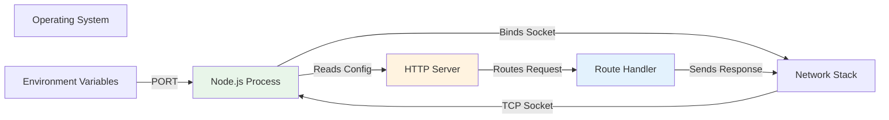

# Technical Specification

# 0. Agent Action Plan

## 0.1 Intent Clarification

### 0.1.1 Core Feature Objective

**Based on the prompt, the Blitzy platform understands that the new feature requirement is to:**

Create a complete, working Node.js tutorial project from scratch that implements a single HTTP endpoint `/hello` which returns the plain text response "Hello world" when accessed via HTTP GET request. This project serves as an educational foundation for developers learning Node.js server-side development.

**Enhanced Clarity of Requirements:**

- **HTTP Server Implementation**: Establish a fully functional HTTP server capable of listening on a configurable port (default 3000 or alternative 8080) on the localhost interface (127.0.0.1)

- **Single Endpoint Definition**: Implement exactly one route handler for the path `/hello` that responds exclusively to GET requests with a 200 OK status and the text "Hello world"

- **Cross-Platform Compatibility**: Ensure the implementation executes successfully on Windows, macOS, and Linux operating systems without platform-specific modifications

- **Minimal Complexity**: Maintain implementation simplicity with a target of under 50 lines of code for the core server logic, making it accessible to beginners

- **Tutorial Purpose**: Design the code structure and documentation to serve educational objectives, prioritizing clarity and understandability over production-grade features

**Implicit Requirements Detected:**

- **Error Handling**: Although not explicitly stated, the server must gracefully handle invalid routes (404 Not Found) and unsupported HTTP methods on the `/hello` endpoint (405 Method Not Allowed)

- **Graceful Shutdown**: The server should respond to termination signals (SIGINT, SIGTERM) and shut down cleanly

- **Port Flexibility**: Support environment variable configuration (PORT) to enable flexible deployment scenarios without code modification

- **Documentation Requirements**: Include clear README documentation with setup instructions, usage examples, and explanation of the implementation approach

- **Dependency Management**: Establish proper Node.js project structure with package.json for dependency tracking and version management

**Feature Dependencies and Prerequisites:**

- **Node.js Runtime**: Requires Node.js LTS version (14.x, 16.x, 18.x, or 20.x) installed on the target machine

- **npm Package Manager**: Required for dependency installation if using Express.js framework

- **Network Availability**: Localhost network interface (127.0.0.1) must be accessible for server binding

- **Port Availability**: Target port (3000 or 8080) must not be occupied by another process

### 0.1.2 Special Instructions and Constraints

**Framework Selection Decision:**

CRITICAL: The implementation must select between two mutually exclusive approaches:

- **Option A - Native `http` Module**: Zero external dependencies, maximum educational transparency, exposes fundamental HTTP mechanics directly
- **Option B - Express.js Framework**: Industry-standard patterns, cleaner syntax, real-world relevance with exactly one external dependency

This Agent Action Plan documents implementation paths for both options, with Express.js recommended for broader industry applicability while maintaining beginner accessibility.

**Architectural Requirements:**

- **Localhost Binding Only**: The server MUST bind exclusively to 127.0.0.1 (not 0.0.0.0) to prevent unintended network exposure in tutorial contexts

- **Stateless Operation**: No session management, user authentication, or persistent data storage between requests

- **Single Process Architecture**: All functionality executes within one Node.js process without clustering, worker threads, or multi-process patterns

- **No Build Step**: The project must run directly via `node server.js` without requiring compilation, transpilation, or build tooling

**Code Quality Constraints:**

- **JavaScript Standard**: Use only standard JavaScript features available across Node.js 14.x through 20.x without experimental flags

- **ESLint Compliance**: Code should follow common JavaScript style conventions (no strict linting enforced but readability prioritized)

- **No TypeScript**: Avoid compilation complexity by using pure JavaScript

- **Minimal Abstraction**: Avoid unnecessary abstraction layers, helper functions, or over-engineering

**Cross-Platform Compatibility:**

- **Path Handling**: Use Node.js `path` module for any file system operations to ensure Windows/Unix compatibility

- **Line Endings**: Git configuration should normalize line endings (CRLF vs LF) automatically

- **No Shell Scripts**: Avoid Bash or PowerShell scripts; use npm scripts or Node.js for automation

**Educational Constraints:**

- **Code Comments**: Include meaningful comments explaining key concepts without over-commenting obvious code

- **Progressive Complexity**: Structure code to enable incremental learning - learners should understand each line before proceeding

- **No Magic**: Avoid implicit framework behaviors or "convention over configuration" patterns that obscure understanding

**User-Provided Examples:**

User Example: "one end point '/hello' that returns 'Hello world' to the calling HTTP client"

This example explicitly defines:
- Exact endpoint path: `/hello` (not `/hello/`, not `/api/hello`, not `/v1/hello`)
- Exact response text: `"Hello world"` (capitalization and spelling as specified)
- Transport protocol: HTTP (not HTTPS, WebSocket, or other protocols)
- Response recipient: The HTTP client making the request

### 0.1.3 Technical Interpretation

**These feature requirements translate to the following technical implementation strategy:**

**To implement the HTTP server foundation**, we will create a new Node.js project with proper package.json configuration, establishing the project structure that supports both development and execution. The project will be initialized with `npm init` with fields configured for tutorial purposes including clear name, description, and entry point specification.

**To implement the `/hello` endpoint**, we will create a server.js file (or app.js) that instantiates an HTTP server (either using native `http.createServer()` or `express()` constructor), defines a route handler matching the exact path `/hello`, validates the HTTP method is GET, and generates a response with status 200, Content-Type header `text/plain; charset=utf-8`, and body content `"Hello world"`.

**To ensure cross-platform compatibility**, we will avoid platform-specific APIs, use only Node.js built-in modules (plus Express if selected), bind exclusively to localhost interface using IP address 127.0.0.1, and implement environment variable PORT configuration with fallback defaults (3000 primary, 8080 alternative).

**To provide graceful error handling**, we will implement 404 Not Found responses for undefined routes, 405 Method Not Allowed responses for non-GET requests to `/hello` endpoint, and graceful shutdown handlers for SIGINT and SIGTERM signals that complete in-flight requests before termination.

**To enable flexible configuration**, we will implement PORT environment variable support allowing `PORT=8080 node server.js` invocation, provide sensible defaults (3000) when PORT is undefined, and document environment variable usage in README with clear examples.

**To satisfy educational requirements**, we will include inline code comments explaining HTTP server concepts, create comprehensive README.md with project overview, setup instructions, usage examples, and testing procedures, provide example curl commands and browser testing instructions, and structure code for maximum readability with logical separation of concerns.

**To establish proper dependency management**, we will create package.json with correct Node.js version compatibility specification (engines field), define appropriate npm scripts for starting the server (`npm start`), include metadata fields (name, version, description, author) for completeness, and specify Express.js dependency with exact version if Option B is selected.

**To enable immediate execution**, we will ensure the project can be started via `node server.js` without build steps, works immediately after `npm install` (if using Express), and provides clear console output indicating server status and listening port.

**Implementation Approach Summary:**

| Requirement | Implementation Method | Specific Actions |
|-------------|----------------------|------------------|
| HTTP Server | Native `http` or Express.js | Create server instance, bind to 127.0.0.1, listen on configured port |
| `/hello` Endpoint | Route handler function | Match exact path, validate GET method, send 200 response with "Hello world" |
| Error Handling | Conditional response logic | Implement 404 for unmatched paths, 405 for invalid methods |
| Configuration | Environment variables | Read PORT from process.env with default fallback |
| Documentation | README.md | Include setup, usage, testing, and explanation sections |
| Project Structure | package.json | Define project metadata, dependencies, npm scripts |
| Graceful Shutdown | Signal handlers | Listen for SIGINT/SIGTERM, close server gracefully |

This technical interpretation ensures every aspect of the user's request is addressed with specific, actionable implementation details that guide the development process.

## 0.2 Repository Scope Discovery

### 0.2.1 Comprehensive File Analysis

**Current Repository State:**

The repository currently contains only a single file:
- `README.md` - Minimal file containing only the heading "# Nov18_14"

This represents a greenfield implementation where all project files must be created from scratch.

**Search Patterns for Affected Files:**

Since this is a new project creation rather than modification of existing code, the scope discovery identifies all files that MUST BE CREATED to satisfy the feature requirements:

**Core Application Files:**
- `server.js` OR `app.js` OR `index.js` - Main HTTP server entry point implementing the `/hello` endpoint
- `package.json` - Node.js project manifest defining dependencies, scripts, and metadata
- `.gitignore` - Git exclusion patterns to prevent committing node_modules and other generated files

**Documentation Files:**
- `README.md` (MODIFY EXISTING) - Comprehensive project documentation with setup, usage, and testing instructions
- `LICENSE` (OPTIONAL) - Software license file if open-source distribution is intended

**Configuration Files:**
- `.env.example` (OPTIONAL) - Example environment variable configuration showing PORT and other settings
- `.nvmrc` OR `.node-version` (OPTIONAL) - Node.js version specification for version managers

**Dependency Lock Files (Auto-Generated):**
- `package-lock.json` - Automatically generated when using npm to install dependencies
- `node_modules/` - Directory containing installed dependencies (if Express.js is used)

**Testing Files (OPTIONAL for Enhanced Implementation):**
- `test/server.test.js` OR `tests/server.test.js` - Basic endpoint verification tests
- `.github/workflows/test.yml` - CI/CD pipeline for automated testing (advanced scenario)

### 0.2.2 Integration Point Discovery

**API Endpoints That Connect to the Feature:**

Since this is a standalone tutorial project, there are no existing API endpoints to integrate with. The `/hello` endpoint represents the sole API surface of the application.

**Database Models/Migrations Affected:**

NOT APPLICABLE - This project intentionally excludes database integration. No models, schemas, or migrations required.

**Service Classes Requiring Updates:**

NOT APPLICABLE - The project architecture deliberately avoids service layer abstraction. All logic resides in the single server file.

**Controllers/Handlers to Modify:**

NEW CREATION REQUIRED - The route handler for `/hello` must be created from scratch:
- **Native http approach**: Request listener function within `http.createServer()` callback
- **Express.js approach**: Route handler registered via `app.get('/hello', handler)`

**Middleware/Interceptors Impacted:**

NOT APPLICABLE for native http implementation. For Express.js implementation:
- No custom middleware required (framework handles HTTP parsing automatically)
- No authentication, logging, or request transformation middleware needed

### 0.2.3 New File Requirements

**New Source Files to Create:**

| File Path | Purpose | Required | Estimated Lines |
|-----------|---------|----------|-----------------|
| `server.js` | HTTP server implementation with `/hello` endpoint | YES | 30-50 |
| `package.json` | Project manifest with metadata and dependencies | YES | 15-25 |
| `.gitignore` | Git exclusion patterns for node_modules, logs | YES | 10-20 |

**Alternative Naming Conventions:**
- `app.js` instead of `server.js` (equally acceptable, common in Express tutorials)
- `index.js` instead of `server.js` (less descriptive but conventional for package entry points)

**Recommended Choice**: Use `server.js` for maximum clarity about file purpose in tutorial context.

**New Configuration Files:**

| File Path | Purpose | Required | Content Description |
|-----------|---------|----------|---------------------|
| `.env.example` | Environment variable documentation | RECOMMENDED | PORT=3000 with explanatory comments |
| `.nvmrc` | Node.js version specification | OPTIONAL | Single line containing "20" or "20.x" |
| `.editorconfig` | Editor consistency configuration | OPTIONAL | Indentation, line ending specifications |

**New Documentation Files:**

| File Path | Purpose | Required | Key Sections |
|-----------|---------|----------|--------------|
| `README.md` (MODIFY) | Comprehensive project documentation | YES | Overview, Setup, Usage, Testing, Architecture |
| `LICENSE` | Software license terms | OPTIONAL | MIT, ISC, or Apache 2.0 recommended for tutorials |
| `CONTRIBUTING.md` | Contribution guidelines | OPTIONAL | Only if accepting community contributions |

**New Test Files (Optional Enhancement):**

| File Path | Purpose | Required | Test Coverage |
|-----------|---------|----------|---------------|
| `test/server.test.js` | Endpoint verification tests | OPTIONAL | GET /hello returns 200 with "Hello world" |
| `test/server.test.js` | Error handling tests | OPTIONAL | 404 for undefined routes, 405 for wrong methods |

**Note on Test Files**: While testing enhances quality, it introduces complexity (test frameworks, assertion libraries) that may distract from the core tutorial objective. Recommendation: Omit for minimal implementation, include in "Enhanced Version" documentation section.

### 0.2.4 Web Search Research Conducted

**Best Practices Research Findings:**

**For Node.js HTTP Server Implementation:**
- Standard practice uses `http.createServer()` with request listener callback for native implementations
- Port binding to localhost (127.0.0.1) prevents accidental external exposure
- Environment variable PORT configuration enables deployment flexibility
- Console logging of listening port provides immediate user feedback

**For Express.js Implementation:**
- Express 4.x remains the stable, widely-adopted version (5.x still in beta)
- Minimal Express server requires only `express()`, `app.get()`, and `app.listen()` calls
- Express automatically handles request parsing, header management, and response serialization
- Route ordering matters: wildcard routes should be defined last to avoid overshadowing specific routes

**For Project Structure:**
- Single-file implementations acceptable for tutorial purposes (no src/ directory needed)
- package.json "main" field should point to server entry file
- npm "start" script conventionally maps to `node server.js`
- "engines" field ensures version compatibility documentation

**For Error Handling:**
- 404 handling: Native http requires explicit path checking; Express provides automatic 404 for unmatched routes
- 405 handling: Requires manual implementation in both approaches by checking request.method
- Graceful shutdown: SIGINT (Ctrl+C) and SIGTERM handlers should call server.close()

**For Cross-Platform Compatibility:**
- Avoid file system dependencies entirely for maximum compatibility
- Use process.env for configuration rather than .env files requiring parsing libraries
- Line ending normalization handled automatically by Git with proper .gitattributes or global config
- Path separators irrelevant when no path operations performed

**Security Considerations:**

While security is not a primary concern for localhost-only tutorial projects, best practices identified include:
- Binding to 127.0.0.1 (not 0.0.0.0) prevents unintended network exposure
- No user input processing eliminates injection attack surface
- No HTTPS required for localhost development (certificate management adds complexity)
- No authentication/authorization needed for single-endpoint tutorial

### 0.2.5 Complete File Inventory

**Files to CREATE:**

```
project-root/
├── server.js                 # Main HTTP server implementation (30-50 lines)
├── package.json              # Project manifest (15-25 lines)
├── .gitignore               # Git exclusions (10-20 lines)
├── .env.example             # Environment variable documentation (5-10 lines)
└── README.md (MODIFY)       # Comprehensive documentation (100-200 lines)
```

**Files GENERATED Automatically:**

```
project-root/
├── package-lock.json        # Generated by npm install (if Express used)
└── node_modules/            # Generated by npm install (if Express used)
    └── express/             # Express.js dependency tree (if Option B selected)
```

**Files EXCLUDED from Scope:**

- No test files in minimal implementation
- No CI/CD configuration files
- No Docker containerization files
- No database schema or migration files
- No frontend HTML/CSS/JavaScript files
- No API documentation generation (Swagger/OpenAPI)
- No monitoring or logging configuration files

**Total New Files**: 4 required + 1 optional + auto-generated (package-lock.json and node_modules if using Express)

**Estimated Total Lines of Code**: 60-90 lines for core implementation (server.js + package.json + .gitignore)

## 0.3 Dependency Inventory

### 0.3.1 Private and Public Packages

**Package Registry Overview:**

This project has two possible dependency configurations based on the selected implementation approach:

**Option A: Zero External Dependencies (Native http Module)**

| Registry | Package Name | Version | Purpose |
|----------|-------------|---------|---------|
| Built-in | `http` | Bundled with Node.js | Core HTTP server functionality, request/response handling |
| Built-in | `process` | Bundled with Node.js | Environment variable access (process.env.PORT), signal handling |
| Built-in | `console` | Bundled with Node.js | Server status logging and debugging output |

**Option B: Single External Dependency (Express.js Framework)**

| Registry | Package Name | Version | Purpose |
|----------|-------------|---------|---------|
| npm | `express` | `^4.18.2` | HTTP server framework, routing, middleware support |
| npm (transitive) | `body-parser` | `^1.20.1` | HTTP request body parsing (included with Express) |
| npm (transitive) | `cookie-parser` | (N/A - not used) | Cookie parsing (available but not required) |
| Built-in | `http` | Bundled with Node.js | Underlying HTTP implementation used by Express |
| Built-in | `process` | Bundled with Node.js | Environment variable access, signal handling |

**Version Specification Rationale:**

- **Express.js ^4.18.2**: The caret (^) allows minor and patch updates (4.18.x → 4.x.x) but prevents major version upgrades. Version 4.18.2 is the current stable release as of the technical specification creation. This version is verified stable, widely documented, and has no known critical vulnerabilities.

- **Native Modules**: No version specification needed as these ship with Node.js runtime. Compatibility guaranteed across Node.js 14.x through 20.x LTS versions.

**Dependency Tree Depth:**

- **Option A (Native)**: Depth 0 - Zero external dependencies
- **Option B (Express)**: Depth 2-3 - Express has approximately 30 transitive dependencies including body-parser, cookie, debug, finalhandler, and others. Total installation size approximately 2.5-3 MB.

### 0.3.2 Development Dependencies

**No Development Dependencies Required:**

The minimal tutorial implementation intentionally excludes development tooling to maintain simplicity:

**Excluded Development Tools:**

| Tool Category | Common Packages | Exclusion Rationale |
|---------------|----------------|---------------------|
| Testing Frameworks | jest, mocha, chai, supertest | Testing adds complexity beyond tutorial scope; manual testing sufficient |
| Linters | eslint, prettier | Code quality enforced through review; linting configuration burdens beginners |
| Build Tools | webpack, rollup, babel | No transpilation needed; pure JavaScript runs directly |
| Documentation Generators | jsdoc, typedoc | Manual README documentation provides adequate guidance |
| Type Checking | typescript, flow | Type safety valuable but adds compilation complexity |
| Process Managers | nodemon, pm2 | Manual server restart acceptable for tutorial; no hot-reloading needed |

**Rationale for Minimal Dependencies:**

Educational objectives prioritize understanding core concepts over production-grade tooling. Each additional dependency introduces:
- Installation time and potential failures
- Configuration complexity
- Cognitive load understanding tool-specific patterns
- Version compatibility management overhead

For learners, the value of immediate success (running server in 30 seconds) outweighs the long-term benefits of development tooling.

### 0.3.3 Dependency Updates and Import Statements

**Option A: Native http Module Implementation**

**Import Statements Required:**

```javascript
const http = require('http');
```

**Additional Imports (for enhanced implementations):**

```javascript
const process = require('process'); // Explicit import (though globally available)
```

**No Import Updates Required**: Since this is a new project, there are no existing imports to update. All imports are created fresh in server.js.

**Option B: Express.js Framework Implementation**

**Import Statements Required:**

```javascript
const express = require('express');
const app = express();
```

**No Additional Imports Needed**: Express abstracts HTTP functionality, so direct `http` module import is unnecessary.

### 0.3.4 External Reference Updates

**Configuration Files Requiring Dependency References:**

**package.json (NEW FILE):**

```json
{
  "name": "nodejs-hello-world-tutorial",
  "version": "1.0.0",
  "description": "A simple Node.js HTTP server tutorial with a /hello endpoint",
  "main": "server.js",
  "scripts": {
    "start": "node server.js"
  },
  "keywords": ["nodejs", "tutorial", "http", "hello-world"],
  "author": "Tutorial Author",
  "license": "MIT",
  "engines": {
    "node": ">=14.0.0 <=20.x"
  },
  "dependencies": {
    "express": "^4.18.2"
  }
}
```

**For Option A (Native http), remove dependencies object:**

```json
{
  "dependencies": {}
}
```

Or omit the "dependencies" field entirely.

**README.md (MODIFY EXISTING):**

Must document dependency installation instructions:

**For Option A (Native http):**
```markdown
## Prerequisites
- Node.js 14.x, 16.x, 18.x, or 20.x LTS
- No additional dependencies required
```

**For Option B (Express.js):**
```markdown
## Prerequisites
- Node.js 14.x, 16.x, 18.x, or 20.x LTS
- npm (included with Node.js)

## Installation
npm install
```

**.gitignore (NEW FILE):**

Must exclude node_modules directory:

```
node_modules/
npm-debug.log
.env
.DS_Store
```

### 0.3.5 Dependency Installation Commands

**For Option A (Native http):**

```bash
# No installation required - native modules only
node server.js
```

**For Option B (Express.js):**

```bash
# Install dependencies
npm install

# Verify Express installation
npm list express

# Start server
npm start
```

**Expected Output After npm install:**

```
added 57 packages, and audited 58 packages in 3s

7 packages are looking for funding
  run `npm fund` for details

found 0 vulnerabilities
```

### 0.3.6 Version Compatibility Matrix

| Package | Minimum Version | Maximum Version | Node.js 14.x | Node.js 16.x | Node.js 18.x | Node.js 20.x |
|---------|----------------|-----------------|--------------|--------------|--------------|--------------|
| express | 4.18.0 | 4.x.x | ✅ Compatible | ✅ Compatible | ✅ Compatible | ✅ Compatible |
| http (native) | N/A (built-in) | N/A (built-in) | ✅ Compatible | ✅ Compatible | ✅ Compatible | ✅ Compatible |

**Compatibility Notes:**

- **Express 4.x** has been stable since 2014 and maintains backward compatibility across all supported Node.js LTS versions
- **Express 5.x** (currently beta) is NOT used due to instability and potential breaking changes
- **Native http module** has consistent API across all Node.js LTS versions with no breaking changes

### 0.3.7 Dependency Security Considerations

**Express.js Security:**

- Version 4.18.2 has no known critical vulnerabilities as of specification date
- Regular security updates published through npm
- Widely audited by security community due to popularity
- Recommendation: Run `npm audit` after installation to verify security status

**Native Module Security:**

- Node.js runtime security handled by Node.js project team
- No third-party code reduces attack surface
- Localhost binding (127.0.0.1) prevents network-based attacks
- No user input processing eliminates injection vulnerabilities

**Recommended Security Practice:**

```bash
# Check for vulnerabilities after installation
npm audit

# Update to latest patch version if vulnerabilities found
npm update express

# Verify no high-severity issues
npm audit --audit-level=high
```

For this tutorial project with localhost-only access and no user input processing, security risk is minimal regardless of framework choice.

## 0.4 Integration Analysis

### 0.4.1 Existing Code Touchpoints

**Current Repository State: Greenfield Implementation**

Since the repository contains only a minimal README.md with no existing application code, there are NO existing code touchpoints to modify. All integration points must be created from scratch.

**Files Requiring Creation (Not Modification):**

| File Path | Integration Type | Purpose | Lines to Create |
|-----------|-----------------|---------|-----------------|
| `server.js` | NEW FILE | HTTP server initialization, route definition, port binding | 30-50 |
| `package.json` | NEW FILE | Dependency declaration, npm script definition, metadata | 15-25 |
| `.gitignore` | NEW FILE | Version control exclusions for node_modules, logs | 10-20 |
| `README.md` | MODIFY EXISTING | Replace minimal content with comprehensive documentation | 100-200 |

**No Direct Modifications Required:**

Unlike feature additions to existing codebases, this greenfield implementation does not require:
- Updating existing route registration files
- Modifying existing middleware chains
- Integrating with existing authentication systems
- Updating existing database connection pools
- Modifying existing configuration loading logic

### 0.4.2 Dependency Injection Points

**NOT APPLICABLE - No Dependency Injection Framework**

This tutorial project intentionally avoids dependency injection patterns to maintain simplicity. All components (HTTP server, route handler, response generator) are directly instantiated without container-based injection.

**Rationale for Exclusion:**

- Dependency injection adds conceptual complexity inappropriate for beginner tutorials
- Single-file implementation eliminates need for component decoupling
- Direct instantiation provides clearer cause-effect understanding for learners
- No testing framework requiring mock injection

**If Dependency Injection Were Implemented (Out of Scope):**

For educational reference, a production system would inject:
- HTTP server instance into application bootstrapper
- Configuration service for port/host settings
- Logger service for structured logging
- Health check service for monitoring endpoints

### 0.4.3 Database and Schema Integration

**NOT APPLICABLE - No Database Layer**

This project intentionally excludes all database integration:

- **No Database Connections**: No PostgreSQL, MySQL, MongoDB, Redis, or any data store connections
- **No Schema Definitions**: No table schemas, document models, or data structures requiring persistence
- **No Migrations**: No database version management or schema evolution scripts
- **No ORM/ODM**: No Sequelize, TypeORM, Mongoose, or data mapping libraries

**Rationale:**

The static "Hello world" response requires no data retrieval, making database integration unnecessary complexity that distracts from HTTP fundamentals.

**Data Flow:**

```
HTTP Request → Route Handler → Static String → HTTP Response
```

No database query occurs in this flow.

### 0.4.4 Environment Configuration Integration

**Environment Variable Integration Points:**

**server.js - Port Configuration:**

```javascript
const PORT = process.env.PORT || 3000;
```

**Integration Details:**

- **Source**: `process.env.PORT` reads from environment variables set by operating system or shell
- **Default Fallback**: Value 3000 used when PORT is undefined
- **Type Coercion**: process.env values are strings; JavaScript's loose typing handles port number conversion
- **Validation**: Optional enhancement could validate PORT is numeric and within valid range (1024-65535)

**Alternative Port Configuration:**

```javascript
const PORT = parseInt(process.env.PORT || '3000', 10);
```

This explicit parsing ensures numeric type and base-10 interpretation.

**.env.example - Documentation File:**

```
# Port number for HTTP server
# Default: 3000
# Alternative: 8080
PORT=3000
```

**Note**: This project does NOT use `dotenv` library for .env file loading. Environment variables must be set via shell commands:

```bash
# Unix/Linux/macOS
export PORT=8080
node server.js

# Windows Command Prompt
set PORT=8080
node server.js

# Windows PowerShell
$env:PORT=8080
node server.js

# Inline (Unix/Linux/macOS)
PORT=8080 node server.js
```

### 0.4.5 Logging and Monitoring Integration

**Console Logging Integration:**

**Server Startup Logging:**

```javascript
server.listen(PORT, '127.0.0.1', () => {
  console.log(`Server running at http://127.0.0.1:${PORT}/`);
  console.log(`Try: curl http://127.0.0.1:${PORT}/hello`);
});
```

**Request Logging (Optional Enhancement):**

```javascript
// Log each incoming request
console.log(`${new Date().toISOString()} - ${req.method} ${req.url}`);
```

**No External Logging Services:**

- No Winston, Bunyan, or Pino structured logging libraries
- No log aggregation services (Splunk, ELK, CloudWatch)
- No application performance monitoring (New Relic, DataDog)
- No error tracking services (Sentry, Rollbar)

**Rationale**: Console output provides sufficient feedback for tutorial purposes. Learners can observe server behavior directly in terminal without configuring external services.

### 0.4.6 Error Handling Integration

**Error Handling Touchpoints in server.js:**

**1. Route-Level Error Handling:**

```javascript
// 404 Not Found for undefined routes
if (req.url !== '/hello') {
  res.statusCode = 404;
  res.setHeader('Content-Type', 'text/plain');
  res.end('404 Not Found');
  return;
}
```

**2. Method-Level Error Handling:**

```javascript
// 405 Method Not Allowed for non-GET requests
if (req.method !== 'GET') {
  res.statusCode = 405;
  res.setHeader('Content-Type', 'text/plain');
  res.setHeader('Allow', 'GET');
  res.end('405 Method Not Allowed');
  return;
}
```

**3. Server-Level Error Handling:**

```javascript
server.on('error', (err) => {
  if (err.code === 'EADDRINUSE') {
    console.error(`Port ${PORT} is already in use`);
    process.exit(1);
  }
  console.error('Server error:', err);
});
```

**4. Graceful Shutdown Handling:**

```javascript
// Handle Ctrl+C (SIGINT)
process.on('SIGINT', () => {
  console.log('\\nShutting down gracefully...');
  server.close(() => {
    console.log('Server closed');
    process.exit(0);
  });
});
```

**Express.js Alternative Error Handling:**

```javascript
// 404 handler (must be last route)
app.use((req, res) => {
  res.status(404).send('404 Not Found');
});

// Error handler
app.use((err, req, res, next) => {
  console.error(err.stack);
  res.status(500).send('Internal Server Error');
});
```

### 0.4.7 Testing Integration Points

**Manual Testing Integration:**

Since this project excludes automated testing frameworks, testing integrates through manual verification:

**Command-Line Testing (curl):**

```bash
# Test successful response
curl http://127.0.0.1:3000/hello

# Test 404 error
curl http://127.0.0.1:3000/invalid

# Test 405 error
curl -X POST http://127.0.0.1:3000/hello
```

**Browser Testing:**

Navigate to `http://127.0.0.1:3000/hello` in web browser and verify "Hello world" appears.

**No Test Framework Integration:**

- No Jest, Mocha, or Jasmine test runners
- No Supertest HTTP assertion library
- No test coverage reporting (Istanbul, nyc)
- No continuous integration test execution

**Rationale**: Manual testing provides immediate feedback appropriate for tutorial scope. Automated testing introduces additional dependencies, configuration, and concepts that distract from HTTP server fundamentals.

### 0.4.8 Integration Summary

**Integration Complexity: Minimal**

This greenfield implementation has extremely low integration complexity:

- **Zero existing system integrations**
- **Zero external service dependencies** (beyond OS network stack)
- **Zero database connections**
- **Zero authentication systems**
- **Zero message queue integrations**
- **Zero third-party API calls**

**Primary Integration Points:**

1. **Operating System Network Stack** - Via Node.js `http` module or Express.js
2. **Process Environment Variables** - Via `process.env.PORT`
3. **Console Output Stream** - Via `console.log()`
4. **Process Signal Handlers** - Via `process.on('SIGINT')`

**Integration Diagram:**



**No Complex Integration Patterns:**

- No service mesh or API gateway integration
- No distributed tracing (OpenTelemetry, Zipkin)
- No circuit breakers or retry logic
- No message broker integration (RabbitMQ, Kafka)
- No caching layer integration (Redis, Memcached)

This minimal integration profile makes the project ideal for educational purposes, allowing learners to focus on HTTP server fundamentals without distributed system complexity.

## 0.5 Technical Implementation

### 0.5.1 File-by-File Execution Plan

**CRITICAL: Every file listed below MUST be created or modified to complete this feature implementation.**

### 0.5.2 Group 1 - Core Server Implementation

**File: server.js (CREATE)**

**Purpose**: Implement the HTTP server with `/hello` endpoint handling, error responses, and graceful shutdown.

**Implementation Requirements:**

**Option A - Native http Module Approach:**

```javascript
const http = require('http');

const PORT = parseInt(process.env.PORT || '3000', 10);
const HOST = '127.0.0.1';

const server = http.createServer((req, res) => {
  // Route matching for /hello endpoint
  if (req.url === '/hello' && req.method === 'GET') {
    res.statusCode = 200;
    res.setHeader('Content-Type', 'text/plain; charset=utf-8');
    res.end('Hello world');
    return;
  }
  
  // Handle wrong method on /hello endpoint
  if (req.url === '/hello' && req.method !== 'GET') {
    res.statusCode = 405;
    res.setHeader('Content-Type', 'text/plain; charset=utf-8');
    res.setHeader('Allow', 'GET');
    res.end('405 Method Not Allowed');
    return;
  }
  
  // Handle 404 for all other routes
  res.statusCode = 404;
  res.setHeader('Content-Type', 'text/plain; charset=utf-8');
  res.end('404 Not Found');
});

// Start server
server.listen(PORT, HOST, () => {
  console.log(`Server running at http://${HOST}:${PORT}/`);
  console.log(`Try: curl http://${HOST}:${PORT}/hello`);
});

// Handle server errors
server.on('error', (err) => {
  if (err.code === 'EADDRINUSE') {
    console.error(`Error: Port ${PORT} is already in use`);
    process.exit(1);
  }
  console.error('Server error:', err);
  process.exit(1);
});

// Graceful shutdown on Ctrl+C
process.on('SIGINT', () => {
  console.log('\\nShutting down gracefully...');
  server.close(() => {
    console.log('Server closed');
    process.exit(0);
  });
});

// Graceful shutdown on SIGTERM
process.on('SIGTERM', () => {
  console.log('\\nShutting down gracefully...');
  server.close(() => {
    console.log('Server closed');
    process.exit(0);
  });
});
```

**Option B - Express.js Framework Approach:**

```javascript
const express = require('express');
const app = express();

const PORT = parseInt(process.env.PORT || '3000', 10);
const HOST = '127.0.0.1';

// GET /hello endpoint
app.get('/hello', (req, res) => {
  res.status(200).type('text/plain').send('Hello world');
});

// 404 handler for undefined routes
app.use((req, res) => {
  res.status(404).type('text/plain').send('404 Not Found');
});

// Start server
const server = app.listen(PORT, HOST, () => {
  console.log(`Server running at http://${HOST}:${PORT}/`);
  console.log(`Try: curl http://${HOST}:${PORT}/hello`);
});

// Handle server errors
server.on('error', (err) => {
  if (err.code === 'EADDRINUSE') {
    console.error(`Error: Port ${PORT} is already in use`);
    process.exit(1);
  }
  console.error('Server error:', err);
  process.exit(1);
});

// Graceful shutdown handlers
const shutdown = () => {
  console.log('\\nShutting down gracefully...');
  server.close(() => {
    console.log('Server closed');
    process.exit(0);
  });
};

process.on('SIGINT', shutdown);
process.on('SIGTERM', shutdown);
```

**Key Implementation Details:**

- PORT configuration via environment variable with 3000 default
- HOST binding to 127.0.0.1 (localhost only) for security
- Exact path matching for `/hello` (not `/hello/` or substring matches)
- Case-sensitive path matching (`/hello` not `/Hello`)
- Content-Type header set to `text/plain; charset=utf-8`
- 405 response includes `Allow: GET` header per HTTP specification
- Server error handling for common failure cases (EADDRINUSE)
- Graceful shutdown on SIGINT (Ctrl+C) and SIGTERM signals

**Lines of Code**: 35-45 lines (depending on approach and comments)

### 0.5.3 Group 2 - Project Configuration

**File: package.json (CREATE)**

**Purpose**: Define Node.js project metadata, dependencies, npm scripts, and version compatibility requirements.

**Implementation for Option A (Native http):**

```json
{
  "name": "nodejs-hello-world-tutorial",
  "version": "1.0.0",
  "description": "A minimal Node.js tutorial project with a single /hello endpoint that returns Hello world",
  "main": "server.js",
  "scripts": {
    "start": "node server.js"
  },
  "keywords": [
    "nodejs",
    "tutorial",
    "http",
    "hello-world",
    "beginner"
  ],
  "author": "Tutorial Author",
  "license": "MIT",
  "engines": {
    "node": ">=14.0.0 <=20.x"
  }
}
```

**Implementation for Option B (Express.js):**

```json
{
  "name": "nodejs-hello-world-tutorial",
  "version": "1.0.0",
  "description": "A minimal Node.js tutorial project with a single /hello endpoint using Express.js",
  "main": "server.js",
  "scripts": {
    "start": "node server.js"
  },
  "keywords": [
    "nodejs",
    "tutorial",
    "express",
    "http",
    "hello-world",
    "beginner"
  ],
  "author": "Tutorial Author",
  "license": "MIT",
  "engines": {
    "node": ">=14.0.0 <=20.x"
  },
  "dependencies": {
    "express": "^4.18.2"
  }
}
```

**Key Configuration Elements:**

- `name`: Lowercase, hyphen-separated identifier
- `version`: Semantic versioning starting at 1.0.0
- `description`: Clear explanation of project purpose
- `main`: Entry point file (server.js)
- `scripts.start`: Defines `npm start` command
- `engines.node`: Specifies compatible Node.js versions (14.x through 20.x)
- `dependencies.express`: Version ^4.18.2 allows minor/patch updates within 4.x

**Lines of Code**: 15-25 lines

**File: .gitignore (CREATE)**

**Purpose**: Exclude generated files and sensitive data from version control.

**Implementation:**

```
# Dependencies
node_modules/
npm-debug.log
yarn-error.log
package-lock.json

# Environment variables
.env
.env.local
.env.*.local

# Operating system files
.DS_Store
Thumbs.db
Desktop.ini

# IDE and editor files
.vscode/
.idea/
*.swp
*.swo
*~

# Logs
logs/
*.log
npm-debug.log*
```

**Key Exclusions:**

- `node_modules/`: Installed dependencies (regenerated via npm install)
- `package-lock.json`: Optional exclusion (some prefer to commit this)
- `.env`: Environment variables with sensitive data
- `.DS_Store`: macOS system files
- IDE configuration folders

**Lines of Code**: 15-20 lines

**File: .env.example (CREATE)**

**Purpose**: Document available environment variables with example values.

**Implementation:**

```
# Port number for HTTP server
# Default: 3000 if not specified
# Common alternatives: 8080, 5000
PORT=3000

# Host interface binding
# Default: 127.0.0.1 (localhost only)
# WARNING: Using 0.0.0.0 exposes server to network
# HOST=127.0.0.1
```

**Lines of Code**: 8-10 lines

### 0.5.4 Group 3 - Documentation

**File: README.md (MODIFY EXISTING)**

**Purpose**: Replace minimal existing content with comprehensive project documentation including setup, usage, testing, and architecture explanation.

**Implementation Structure:**

```markdown
# Node.js Hello World Tutorial

A minimal Node.js tutorial project demonstrating HTTP server fundamentals with a single endpoint that returns "Hello world".

## Overview

This project serves as an educational introduction to Node.js server-side development, implementing a simple HTTP server with one endpoint (`/hello`) that responds with "Hello world" to GET requests. The implementation prioritizes clarity and simplicity, making it ideal for developers new to Node.js.

## Features

- Single HTTP endpoint: `GET /hello` returns "Hello world"
- Localhost-only binding for security (127.0.0.1)
- Configurable port via environment variable
- Graceful error handling (404, 405 responses)
- Clean shutdown on termination signals
- Cross-platform compatible (Windows, macOS, Linux)

## Prerequisites

- Node.js 14.x, 16.x, 18.x, or 20.x LTS
- npm (included with Node.js installation)

## Installation

**Clone the repository:**
```bash
git clone <repository-url>
cd nodejs-hello-world-tutorial
```

**Install dependencies** (only required for Express.js version):
```bash
npm install
```

## Usage

**Start the server:**
```bash
npm start
```

Or directly with Node.js:
```bash
node server.js
```

**With custom port:**
```bash
PORT=8080 npm start
```

**Expected output:**
```
Server running at http://127.0.0.1:3000/
Try: curl http://127.0.0.1:3000/hello
```

## Testing

**Using curl:**
```bash
# Test successful response
curl http://127.0.0.1:3000/hello
# Expected: Hello world

# Test 404 error
curl http://127.0.0.1:3000/invalid
# Expected: 404 Not Found

# Test 405 error (wrong method)
curl -X POST http://127.0.0.1:3000/hello
# Expected: 405 Method Not Allowed
```

**Using a web browser:**

Navigate to `http://127.0.0.1:3000/hello` and verify "Hello world" appears in the browser.

## Architecture

This project implements a simple request-response architecture:

1. HTTP client sends GET request to /hello endpoint
2. Server matches the route and validates HTTP method
3. Server generates 200 OK response with "Hello world" text
4. Client receives response

**Component Breakdown:**
- **HTTP Server**: Listens on port 3000 (configurable) at localhost interface
- **Route Handler**: Matches /hello path and validates GET method
- **Response Generator**: Returns plain text "Hello world" with appropriate headers

## API Endpoints

### GET /hello

Returns a simple greeting message.

**Response:**
- Status: 200 OK
- Content-Type: text/plain; charset=utf-8
- Body: Hello world

**Example:**
```bash
curl http://127.0.0.1:3000/hello
```

### Error Responses

**404 Not Found** - Returned for undefined routes:
```bash
curl http://127.0.0.1:3000/undefined
```

**405 Method Not Allowed** - Returned for non-GET requests to /hello:
```bash
curl -X POST http://127.0.0.1:3000/hello
```

## Configuration

**Environment Variables:**

- `PORT`: Server port number (default: 3000)

**Example:**
```bash
export PORT=8080  # Unix/Linux/macOS
set PORT=8080     # Windows CMD
$env:PORT=8080    # Windows PowerShell
```

## Project Structure

```
nodejs-hello-world-tutorial/
├── server.js          # Main HTTP server implementation
├── package.json       # Project metadata and dependencies
├── .gitignore        # Git exclusion patterns
├── .env.example      # Environment variable documentation
└── README.md         # This file
```

## Troubleshooting

**Error: Port already in use**
```
Error: Port 3000 is already in use
```
Solution: Use a different port via PORT environment variable or stop the process using port 3000.

**Error: Cannot find module 'express'** (Express version only)
```
Error: Cannot find module 'express'
```
Solution: Run `npm install` to install dependencies.

## Learning Objectives

After working with this project, you should understand:

- How to create an HTTP server in Node.js
- How to handle HTTP requests and responses
- How to implement route matching and method validation
- How to configure servers via environment variables
- How to implement graceful error handling and shutdown

## Next Steps

To extend this tutorial project, consider:

- Adding more endpoints (GET /goodbye, GET /time)
- Implementing POST endpoint with request body parsing
- Adding JSON response support
- Implementing query parameter handling
- Adding request logging middleware
- Writing automated tests with a testing framework

## License

MIT License - feel free to use this project for learning purposes.

## Author

Tutorial Author

## Contributing

This is a tutorial project. Feel free to fork and experiment!
```

**Lines of Code**: 150-200 lines (markdown)

**Key Documentation Sections:**

- Clear project overview and purpose
- Prerequisites and installation instructions
- Usage examples with expected output
- Testing procedures for both success and error cases
- Architecture explanation for educational value
- API endpoint documentation
- Configuration options
- Troubleshooting common issues
- Learning objectives
- Suggestions for extension and next steps

### 0.5.5 Implementation Approach Summary

**Phase 1: Project Initialization**

1. Create project directory and initialize Git repository
2. Create package.json with appropriate configuration
3. Create .gitignore to exclude generated files

**Phase 2: Core Implementation**

4. Create server.js with HTTP server implementation
5. Implement /hello route handler with exact path matching
6. Implement error handling for 404 and 405 cases
7. Add graceful shutdown handlers for SIGINT/SIGTERM

**Phase 3: Configuration and Documentation**

8. Create .env.example with configuration documentation
9. Update README.md with comprehensive documentation
10. Add inline code comments explaining key concepts

**Phase 4: Verification**

11. Install dependencies (if using Express): `npm install`
12. Start server: `npm start`
13. Test /hello endpoint: `curl http://127.0.0.1:3000/hello`
14. Verify error handling: Test 404 and 405 responses
15. Test graceful shutdown: Ctrl+C should close cleanly

**Total Implementation Time Estimate**: 30-60 minutes for complete implementation including testing and documentation.

**Success Criteria:**

- Server starts without errors
- GET /hello returns "Hello world" with 200 status
- Invalid routes return 404 Not Found
- Wrong methods return 405 Method Not Allowed
- Server shuts down gracefully on Ctrl+C
- README provides clear setup and usage instructions
- All files properly excluded by .gitignore

## 0.6 Scope Boundaries

### 0.6.1 Exhaustively In Scope

**Core Implementation Files (MUST BE CREATED):**

- `server.js` - Complete HTTP server implementation with /hello endpoint, error handling, and graceful shutdown
- `package.json` - Project manifest with metadata, dependencies (if Express), npm scripts, and version compatibility
- `.gitignore` - Version control exclusions for node_modules, logs, environment files, and OS-specific files
- `.env.example` - Environment variable documentation with PORT configuration and usage examples
- `README.md` (MODIFICATION REQUIRED) - Replace existing minimal content with comprehensive documentation including:
  - Project overview and features
  - Prerequisites and installation instructions
  - Usage examples with commands and expected output
  - Testing procedures for success and error cases
  - Architecture explanation
  - API endpoint documentation
  - Configuration options
  - Troubleshooting guide
  - Learning objectives
  - Next steps for extension

**HTTP Server Functionality:**

- Server initialization and binding to 127.0.0.1 (localhost only)
- Port configuration via PORT environment variable with default 3000
- Alternative port 8080 support
- TCP socket listener establishment
- HTTP/1.1 protocol handling

**Route Implementation:**

- GET /hello endpoint implementation returning exact text "Hello world"
- Exact path matching for `/hello` (case-sensitive, no trailing slash)
- HTTP method validation (GET only)
- Response with status 200 OK
- Response header: Content-Type: text/plain; charset=utf-8
- Response body: Exactly "Hello world" (12 bytes)

**Error Handling:**

- 404 Not Found responses for undefined routes
- 405 Method Not Allowed responses for non-GET requests to /hello
- 405 response must include Allow: GET header per HTTP specification
- Server error handling for EADDRINUSE (port already in use)
- Generic server error handling with console logging
- Graceful error messages to console

**Shutdown Handling:**

- SIGINT signal handler (Ctrl+C in terminal)
- SIGTERM signal handler (process termination)
- Graceful server closure completing active requests
- Clean process exit after server closure
- Informative console messages during shutdown

**Configuration Management:**

- Environment variable reading via process.env.PORT
- Default fallback values when PORT undefined
- Integer parsing of PORT value
- Host binding hardcoded to 127.0.0.1 (not configurable)

**Console Output:**

- Server startup message with listening URL
- Example curl command for user convenience
- Error messages for port conflicts
- Shutdown status messages
- Graceful shutdown confirmation

**Project Metadata:**

- package.json name field (nodejs-hello-world-tutorial or similar)
- package.json version field (1.0.0)
- package.json description field (clear project purpose)
- package.json main field (server.js)
- package.json scripts.start field (node server.js)
- package.json keywords array (nodejs, tutorial, http, hello-world)
- package.json engines.node field (>=14.0.0 <=20.x)
- package.json dependencies (express ^4.18.2 if Option B)
- package.json license field (MIT recommended)

**Version Control Configuration:**

- .gitignore exclusions:
  - node_modules/
  - npm-debug.log
  - .env and .env.local files
  - Operating system files (.DS_Store, Thumbs.db)
  - IDE configuration (.vscode/, .idea/)
  - Log files (*.log)

**Documentation Scope:**

- Installation procedures
- Usage instructions with command examples
- Testing procedures with curl and browser
- Architecture explanation for educational value
- API endpoint specification
- Error response documentation
- Configuration documentation
- Troubleshooting common issues
- Learning objectives statement
- Extension suggestions

**Cross-Platform Compatibility:**

- Windows 10+ support
- macOS 10.15+ support
- Linux (Ubuntu 18.04+) support
- Consistent behavior across all platforms
- No platform-specific code paths
- No OS-specific dependencies

**Node.js Version Compatibility:**

- Node.js 14.x LTS (Fermium) support
- Node.js 16.x LTS (Gallium) support
- Node.js 18.x LTS (Hydrogen) support
- Node.js 20.x LTS (Iron) support
- No experimental features requiring runtime flags

**File Pattern Coverage:**

- All project root files matching:
  - server.js (or app.js, index.js)
  - package.json
  - .gitignore
  - .env.example
  - README.md

**Auto-Generated Files (In Scope but Generated):**

- package-lock.json (generated by npm install if Express used)
- node_modules/ (generated by npm install if Express used)

### 0.6.2 Explicitly Out of Scope

**Additional Endpoints:**

- No GET /goodbye endpoint
- No GET /api/* endpoints
- No POST endpoints with request body parsing
- No PUT, PATCH, DELETE endpoints
- No WebSocket endpoints
- No GraphQL endpoints
- No health check endpoint (/health, /status)
- No metrics endpoint (/metrics)

**Advanced Routing:**

- No route parameters (/hello/:name)
- No query parameter handling (/hello?name=user)
- No wildcard routes (/hello/*)
- No regular expression route matching
- No route grouping or prefixing (/api/v1/hello)
- No middleware chaining

**Request Processing:**

- No request body parsing (no body-parser for POST data)
- No cookie parsing
- No session management
- No authentication or authorization
- No request validation
- No rate limiting
- No CORS configuration
- No request compression (gzip)

**Response Enhancements:**

- No JSON response support
- No HTML rendering
- No template engines (EJS, Pug, Handlebars)
- No static file serving
- No file downloads
- No streaming responses
- No response caching headers

**Database Integration:**

- No SQL databases (PostgreSQL, MySQL, SQLite)
- No NoSQL databases (MongoDB, Redis, DynamoDB)
- No ORM/ODM libraries (Sequelize, TypeORM, Mongoose)
- No database connection pooling
- No migrations or schema management
- No database seeding scripts

**External Service Integration:**

- No external API calls
- No OAuth authentication providers
- No payment processing
- No email sending services
- No SMS/notification services
- No cloud service integrations (AWS, Azure, GCP)
- No CDN integration

**Security Features:**

- No HTTPS/TLS encryption
- No SSL certificate configuration
- No authentication tokens (JWT)
- No password hashing
- No input sanitization (no user input)
- No SQL injection prevention (no database)
- No XSS prevention
- No CSRF protection
- No security headers (helmet middleware)

**Testing Infrastructure:**

- No automated test suites
- No testing frameworks (Jest, Mocha, Jasmine)
- No test runners
- No assertion libraries (Chai, Should.js)
- No HTTP testing libraries (Supertest)
- No test coverage tools (Istanbul, nyc)
- No integration tests
- No end-to-end tests
- No performance tests
- No load testing

**Development Tools:**

- No TypeScript compilation
- No Babel transpilation
- No webpack or bundling
- No hot module replacement
- No nodemon auto-restart
- No ESLint configuration
- No Prettier formatting
- No pre-commit hooks (Husky)
- No code quality tools (SonarQube)

**Logging and Monitoring:**

- No structured logging libraries (Winston, Bunyan, Pino)
- No log aggregation (Splunk, ELK stack)
- No application performance monitoring (New Relic, DataDog)
- No error tracking services (Sentry, Rollbar)
- No distributed tracing (OpenTelemetry, Zipkin)
- No metrics collection (Prometheus)
- No uptime monitoring

**Deployment Infrastructure:**

- No Docker containerization
- No docker-compose configuration
- No Kubernetes manifests
- No CI/CD pipelines (GitHub Actions, GitLab CI, Jenkins)
- No deployment scripts
- No infrastructure as code (Terraform, CloudFormation)
- No serverless configuration (AWS Lambda, Azure Functions)

**Process Management:**

- No clustering or multi-process architecture
- No PM2 or Forever process managers
- No worker threads
- No child processes
- No load balancing
- No blue-green deployment
- No rolling updates

**Documentation Tools:**

- No API documentation generation (Swagger/OpenAPI)
- No JSDoc code documentation
- No documentation websites (Docusaurus, GitBook)
- No architecture decision records (ADRs)
- No changelog generation

**Performance Optimizations:**

- No response caching (Redis, Memcached)
- No connection pooling
- No query optimization
- No CDN integration
- No asset minification
- No lazy loading
- No code splitting

**Advanced Features:**

- No internationalization (i18n)
- No localization (l10n)
- No feature flags
- No A/B testing
- No analytics integration
- No user tracking
- No search functionality
- No pagination
- No filtering or sorting

**Alternative Implementations:**

- No WebSocket server
- No GraphQL server
- No gRPC server
- No SOAP service
- No FTP server
- No SMTP server

**Additional Configuration Files:**

- No .eslintrc configuration
- No .prettierrc configuration
- No tsconfig.json (no TypeScript)
- No jest.config.js
- No babel.config.js
- No webpack.config.js

### 0.6.3 Scope Boundary Summary

**In Scope Summary:**

This implementation creates a minimal, functional Node.js HTTP server with exactly one endpoint that serves the educational purpose of demonstrating HTTP fundamentals. The scope includes only essential files (4-5 files totaling ~200-250 lines of code) with comprehensive documentation and basic error handling.

**Out of Scope Summary:**

All production-grade features, advanced routing, database integration, external services, automated testing, deployment infrastructure, monitoring, security enhancements beyond localhost binding, and development tooling are explicitly excluded. These exclusions maintain the tutorial's focus on HTTP server fundamentals without overwhelming beginners with complexity.

**Scope Rationale:**

The narrow scope enables learners to:
- Understand complete implementation in under 1 hour
- Read and comprehend every line of code
- Run the server within 5 minutes of checkout
- Extend functionality incrementally for self-directed learning

**Scope Enforcement:**

Any feature not explicitly listed in Section 0.6.1 "Exhaustively In Scope" is automatically considered out of scope unless specifically approved through requirements revision process.

## 0.7 Special Instructions for Feature Addition

### 0.7.1 Framework Selection Guidance

**CRITICAL DECISION POINT: Choose Implementation Approach Before Beginning**

This implementation requires selecting between two mutually exclusive approaches. Both satisfy all functional requirements but differ in educational philosophy and extensibility:

**Decision Criteria:**

| Criterion | Native http Module | Express.js Framework | Recommendation |
|-----------|-------------------|---------------------|----------------|
| **Learning Depth** | Exposes HTTP fundamentals directly | Abstracts HTTP details | Native for deeper understanding |
| **Industry Relevance** | Less common in production | Industry standard pattern | Express for career preparation |
| **Code Simplicity** | More verbose, manual routing | Cleaner syntax, less code | Native for transparency |
| **Extensibility** | Requires manual implementation | Easy to add features | Express for experimentation |
| **Dependency Count** | Zero external dependencies | One external dependency | Native for minimal complexity |
| **Installation Speed** | Instant (no npm install) | ~3 seconds for npm install | Native for immediate execution |

**Recommended Selection**: **Express.js Framework** for broader industry applicability while maintaining beginner accessibility. However, the native http module approach is equally valid for learners prioritizing fundamental understanding.

**IMPORTANT**: Once selected, commit to the chosen approach throughout implementation. Do not mix native http and Express patterns in the same file.

### 0.7.2 Localhost Binding Requirement

**MANDATORY SECURITY CONSTRAINT: Bind to 127.0.0.1 Only**

The server MUST bind exclusively to the localhost interface (127.0.0.1), not to all interfaces (0.0.0.0). This prevents unintended network exposure in tutorial contexts.

**Correct Implementation:**

```javascript
server.listen(PORT, '127.0.0.1', callback);
```

**INCORRECT Implementation (Do Not Use):**

```javascript
server.listen(PORT, callback);              // Binds to 0.0.0.0 by default
server.listen(PORT, '0.0.0.0', callback);  // Exposes to network
```

**Rationale**: Tutorial users may run this server on shared networks, public WiFi, or development machines connected to the internet. Binding to 0.0.0.0 would expose the server to network traffic, creating unintended security exposure. Localhost binding ensures the server is accessible only from the local machine.

**Verification**: After starting the server, verify it's not accessible from another machine on the same network.

### 0.7.3 Exact Response Text Requirement

**CRITICAL: Response Text Must Match Exactly**

The response from GET /hello MUST be exactly `"Hello world"` with:
- Capital "H" in "Hello"
- Lowercase "w" in "world"
- Single space between words
- No trailing newline or whitespace (unless explicitly added by res.end())
- No punctuation (no period, exclamation mark, etc.)

**Correct Implementation:**

```javascript
res.end('Hello world');
```

**INCORRECT Implementations (Do Not Use):**

```javascript
res.end('Hello World');     // Wrong: capital W
res.end('hello world');     // Wrong: lowercase h
res.end('Hello  world');    // Wrong: double space
res.end('Hello world!');    // Wrong: exclamation mark
res.end('Hello world.');    // Wrong: period
res.end('Hello world\\n');   // Wrong: trailing newline
```

**Testing Verification**: Use curl or browser to verify exact response:

```bash
curl http://127.0.0.1:3000/hello | od -c
```

Should show: `H e l l o   w o r l d` (12 characters total)

### 0.7.4 Path Matching Requirements

**Exact Path Match Required: `/hello` Only**

The endpoint must match the exact path `/hello` with:
- No trailing slash (`/hello/` should return 404)
- Case-sensitive matching (`/Hello` or `/HELLO` should return 404)
- No prefix or suffix paths (`/api/hello` or `/hello/user` should return 404)

**Correct Path Matching Logic:**

```javascript
if (req.url === '/hello') {  // Exact equality check
  // Handle /hello
}
```

**INCORRECT Path Matching (Do Not Use):**

```javascript
if (req.url.startsWith('/hello')) {  // Matches /hello, /hello/, /hello/user
if (req.url.includes('hello')) {     // Matches /api/hello, /say-hello
if (req.url.match(/hello/i)) {       // Case-insensitive, matches /Hello
```

**Edge Cases to Handle:**

- `/hello` - SHOULD return 200 OK with "Hello world"
- `/hello/` - SHOULD return 404 Not Found
- `/hello?name=test` - SHOULD return 200 OK (ignore query params) OR return 404 (stricter interpretation)
- `/Hello` - SHOULD return 404 Not Found
- `/HELLO` - SHOULD return 404 Not Found
- `/hello/world` - SHOULD return 404 Not Found

**Recommended Approach**: Use strict equality (`req.url === '/hello'`) to reject query parameters and trailing slashes for maximum educational clarity about exact path matching.

### 0.7.5 Error Response Requirements

**404 Not Found Standard:**

- Status Code: 404
- Content-Type: text/plain; charset=utf-8
- Body: "404 Not Found" (recommended) or custom message
- Triggered for: Any path other than `/hello`

**405 Method Not Allowed Standard:**

- Status Code: 405
- Content-Type: text/plain; charset=utf-8
- Required Header: `Allow: GET` (per HTTP specification)
- Body: "405 Method Not Allowed" (recommended) or custom message
- Triggered for: Non-GET requests to `/hello` path

**Implementation Pattern:**

```javascript
// Check path first, then method
if (req.url !== '/hello') {
  // Return 404 - path doesn't exist
}

if (req.method !== 'GET') {
  // Return 405 - path exists but method not allowed
  res.setHeader('Allow', 'GET');  // Required!
}
```

**Important**: The `Allow: GET` header in 405 responses is mandated by RFC 7231 Section 6.5.5. Do not omit this header.

### 0.7.6 Graceful Shutdown Pattern

**Required Signal Handlers:**

Both SIGINT (Ctrl+C) and SIGTERM (process termination) must be handled gracefully:

**Correct Implementation:**

```javascript
const shutdown = () => {
  console.log('\\nShutting down gracefully...');
  server.close(() => {
    console.log('Server closed');
    process.exit(0);
  });
};

process.on('SIGINT', shutdown);
process.on('SIGTERM', shutdown);
```

**Why Both Signals**: 
- SIGINT: Sent by terminal when user presses Ctrl+C
- SIGTERM: Sent by process managers, Docker, Kubernetes for graceful shutdown
- server.close(): Stops accepting new connections, waits for existing requests to complete

**Do Not Use**:

```javascript
process.on('SIGINT', () => {
  process.exit(0);  // Abrupt shutdown, may interrupt active requests
});
```

### 0.7.7 Console Output Requirements

**Required Console Messages:**

**On Server Start:**

```javascript
console.log(`Server running at http://127.0.0.1:${PORT}/`);
console.log(`Try: curl http://127.0.0.1:${PORT}/hello`);
```

**Rationale**: 
- First line confirms server is listening
- Second line provides immediate testing command for user convenience
- Use template literals for port interpolation

**On Port Conflict:**

```javascript
if (err.code === 'EADDRINUSE') {
  console.error(`Error: Port ${PORT} is already in use`);
  process.exit(1);
}
```

**On Graceful Shutdown:**

```javascript
console.log('\\nShutting down gracefully...');
server.close(() => {
  console.log('Server closed');
  process.exit(0);
});
```

**Optional Request Logging (Educational Enhancement):**

```javascript
console.log(`${new Date().toISOString()} - ${req.method} ${req.url}`);
```

This helps learners see each incoming request in real-time.

### 0.7.8 PORT Configuration Pattern

**Environment Variable with Fallback:**

```javascript
const PORT = parseInt(process.env.PORT || '3000', 10);
```

**Why parseInt with Radix 10**:
- process.env.PORT is always a string
- parseInt ensures numeric type
- Radix 10 prevents octal interpretation (edge case: PORT=08 shouldn't parse as octal)
- Default '3000' as string prevents NaN if parsing fails

**Alternative Simpler Pattern (Acceptable for Tutorial):**

```javascript
const PORT = process.env.PORT || 3000;
```

This works due to JavaScript's type coercion in listen() call but is less explicit.

**Do Not Use**:

```javascript
const PORT = process.env.PORT;  // May be undefined, causes error
const PORT = 3000;              // Hard-coded, not configurable
```

### 0.7.9 Code Comment Guidelines

**Balance Educational Value with Readability:**

**Good Comments (Explain Why and What for Learners):**

```javascript
// Exact path matching - only /hello, not /hello/ or /hello/world
if (req.url === '/hello') {

// HTTP spec requires Allow header in 405 responses
res.setHeader('Allow', 'GET');

// Close server gracefully, completing active requests before exit
server.close(() => {
```

**Avoid Over-Commenting (Obvious Code):**

```javascript
// Set status code to 200  ❌ Too obvious
res.statusCode = 200;

// Call the listen method  ❌ Too obvious
server.listen(PORT);
```

**Target Audience**: Assume readers know basic JavaScript but are new to Node.js HTTP servers. Comment on HTTP concepts, not JavaScript syntax.

### 0.7.10 README Documentation Requirements

**MANDATORY README Sections:**

1. **Overview** - One paragraph explaining project purpose
2. **Prerequisites** - List Node.js version requirements
3. **Installation** - Step-by-step setup instructions
4. **Usage** - How to start the server with examples
5. **Testing** - How to verify functionality (curl commands)
6. **API Endpoints** - Document GET /hello endpoint
7. **Configuration** - Explain PORT environment variable
8. **Troubleshooting** - Common errors and solutions

**Optional but Recommended Sections:**

- Architecture explanation for educational value
- Learning objectives
- Next steps for extending the project
- Project structure diagram

**Do Not Include**:

- Change logs (single version project)
- Contribution guidelines (tutorial project, not open for contributions unless specified)
- Code of conduct (overkill for tutorial)
- Complex installation alternatives (keep it simple)

### 0.7.11 npm Scripts Configuration

**Required npm Script:**

```json
"scripts": {
  "start": "node server.js"
}
```

This enables `npm start` command, which is conventional for starting Node.js applications.

**Optional but Recommended npm Scripts:**

```json
"scripts": {
  "start": "node server.js",
  "dev": "node server.js",
  "test": "echo \\"No tests defined\\" && exit 0"
}
```

**Do Not Include** (adds unnecessary complexity):

```json
"scripts": {
  "start:prod": "NODE_ENV=production node server.js",  // No env differences in tutorial
  "build": "...",                                       // No build step needed
  "watch": "nodemon server.js",                        // Requires nodemon dependency
  "lint": "eslint .",                                  // Requires ESLint setup
}
```

### 0.7.12 File Naming Conventions

**Recommended File Names:**

- **server.js** (RECOMMENDED) - Clear indication of purpose
- app.js (ACCEPTABLE) - Common in Express tutorials
- index.js (ACCEPTABLE) - Conventional for package entry points

**Choose ONE and Reference Consistently:**

If you choose `server.js`, ensure:
- package.json main field: `"main": "server.js"`
- npm start script: `"start": "node server.js"`
- README usage: `node server.js`
- All documentation references use server.js

**Do Not Use**:
- main.js (less descriptive)
- hello.js (too specific to endpoint)
- api.js (no API beyond one endpoint)
- src/server.js (no src directory for single-file project)

### 0.7.13 Express.js Specific Patterns (If Option B Selected)

**Route Definition Order Matters:**

```javascript
// Define specific routes first
app.get('/hello', handler);

// Define 404 handler last (catches all unmatched routes)
app.use((req, res) => {
  res.status(404).send('404 Not Found');
});
```

**Do Not**:

```javascript
// Wrong: 404 handler first catches everything
app.use((req, res) => {
  res.status(404).send('404 Not Found');
});

app.get('/hello', handler);  // Never reached!
```

**Method Chaining Style (Optional):**

```javascript
app.get('/hello', (req, res) => {
  res.status(200).type('text/plain').send('Hello world');
});
```

This is more concise than setting properties individually but both styles are acceptable.

### 0.7.14 Cross-Platform Testing Checklist

**Before Completing Implementation, Verify:**

- [ ] Server starts without errors on target OS
- [ ] GET /hello returns "Hello world" exactly
- [ ] Invalid routes return 404
- [ ] Wrong methods return 405 with Allow header
- [ ] Ctrl+C shuts down gracefully
- [ ] PORT environment variable changes port successfully
- [ ] README instructions work as written
- [ ] No platform-specific file paths (N/A for this project)
- [ ] Line endings don't cause issues (CRLF vs LF)

**Test on Multiple Terminals if Available:**

- Windows CMD
- Windows PowerShell
- Git Bash (Windows)
- macOS Terminal
- Linux Terminal

### 0.7.15 Implementation Completion Criteria

**Definition of Done:**

The feature implementation is complete when ALL of the following are true:

- [ ] server.js file created with complete implementation
- [ ] package.json file created with correct metadata
- [ ] .gitignore file created with appropriate exclusions
- [ ] .env.example file created with PORT documentation
- [ ] README.md updated with comprehensive documentation
- [ ] Server starts and listens on localhost:3000 (or configured PORT)
- [ ] GET /hello returns exactly "Hello world" with 200 status
- [ ] Invalid routes return 404 Not Found
- [ ] POST /hello returns 405 Method Not Allowed with Allow: GET header
- [ ] Server binds to 127.0.0.1 only (verified, not accessible from network)
- [ ] Ctrl+C triggers graceful shutdown with console messages
- [ ] PORT environment variable successfully changes listening port
- [ ] npm start command works (or node server.js for native option)
- [ ] npm install completes without errors (if Express used)
- [ ] README instructions successfully guide new user through setup
- [ ] All code has appropriate educational comments
- [ ] No ESLint errors (if linting manually checked)
- [ ] All files use consistent code style (indentation, quotes)
- [ ] Git repository initialized with initial commit

**Verification Commands:**

```bash
# Test successful response
curl http://127.0.0.1:3000/hello

# Test 404 error
curl http://127.0.0.1:3000/invalid

# Test 405 error with headers visible
curl -i -X POST http://127.0.0.1:3000/hello

# Test custom port
PORT=8080 node server.js &
curl http://127.0.0.1:8080/hello
```

All commands should produce expected results matching specification.

